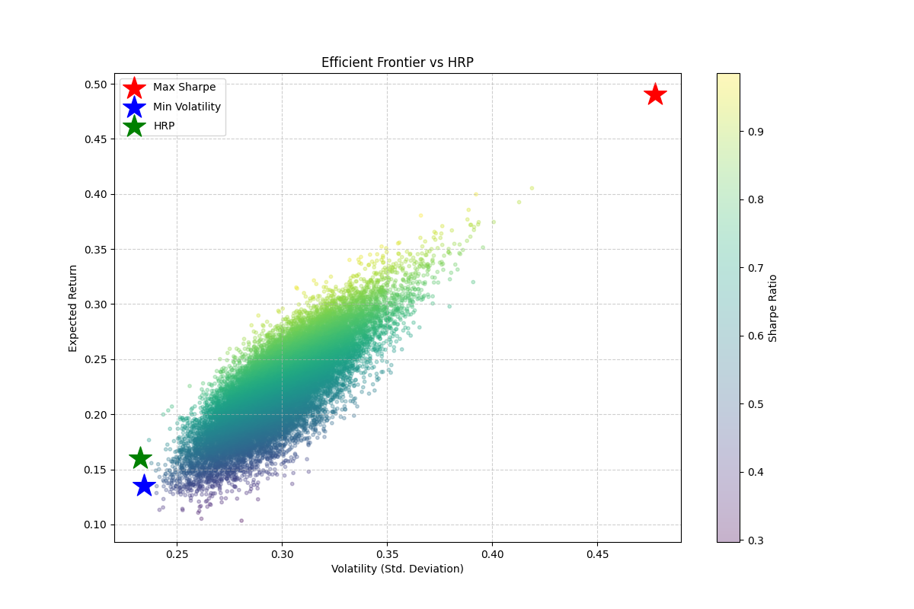

# Portfolio Optimization: Markowitz & Hierarchical Risk Parity (HRP)

This project implements two advanced portfolio optimization techniques to manage a portfolio of 10 assets:
1.  **Markowitz Modern Portfolio Theory (MPT)**: Uses Mean-Variance Optimization to find the Efficient Frontier.
2.  **Hierarchical Risk Parity (HRP)**: A modern machine learning approach (clustering) to allocate risk, avoiding some of the instability issues of MPT.

## Project Structure

- `main.py`: The entry point. Downloads data, runs simulations, and plots results.
- `portfolio_lib.py`: The core library containing algorithms for MPT and HRP.
- `requirements.txt`: List of Python dependencies.
- `efficient_frontier_hrp.png`: Output plot showing the Efficient Frontier and optimal portfolios.

## Installation

1.  **Prerequisites**: Python 3.8+

## Usage

Run the main script, this will:
1.  Download historical data for 10 default tickers (AAPL, MSFT, GOOGL, AMZN, TSLA, JPM, JNJ, V, PG, NVDA).
2.  Run a Monte Carlo simulation (20,000 portfolios) to map the Efficient Frontier.
3.  Calculate the **Max Sharpe Ratio** and **Min Volatility** portfolios.
4.  Calculate the **HRP** allocation.
5.  Print the allocations to the console.
6.  Save a plot as `efficient_frontier_hrp.png`.

## 📉 Example Output

```text
------------------------------
Max Sharpe Ratio Portfolio:
Return: 0.37, Volatility: 0.36
Allocations: PG (27%), JNJ (22%), V (15%), AMZN (14%)...

Min Volatility Portfolio:
Return: 0.14, Volatility: 0.22
Allocations: AMZN (38%), V (22%), NVDA (17%)...

HRP Portfolio:
Return: 0.16, Volatility: 0.23
Allocations: JNJ (29%), PG (24%), MSFT (9%)...
```




## 🧠 Methodology Explained

### 1. Markowitz Optimization (MPT)
MPT assumes investors want to maximize return for a given level of risk.
-   **Covariance Matrix**: Measures how assets move together.
-   **Efficient Frontier**: The set of optimal portfolios that offer the highest expected return for a defined level of risk.
-   **Monte Carlo Simulation**: We generate thousands of random weight combinations to visualize the feasible region and identify the frontier.
-   **Max Sharpe Ratio**: The portfolio with the best risk-adjusted return (Return / Volatility).
-   **Min Volatility**: The portfolio with the absolute lowest risk (standard deviation).

### 2. Hierarchical Risk Parity (HRP)
HRP is a technique introduced by Marcos Lopez de Prado to address the pitfalls of MPT (like the instability of the covariance matrix inversion).
-   **Stage 1: Clustering (Tree Clustering)**:
    -   We calculate the correlation distance between assets.
    -   We use **Single Linkage Clustering** to group similar assets together (e.g., Tech stocks might cluster together, while Consumer Staples cluster separately).
-   **Stage 2: Quasi-Diagonalization**:
    -   We reorder the covariance matrix so that similar assets are placed close to each other. This reveals the hierarchical structure.
-   **Stage 3: Recursive Bisection**:
    -   We split the portfolio into clusters and allocate weights based on the inverse variance of each cluster.
    -   This flows down the tree, ensuring that risk is diversified across "branches" (clusters) rather than just individual assets.

## Results Interpretation

-   **Max Sharpe (Red Star)**: Ideal for growth-focused investors who accept risk for higher returns.
-   **Min Volatility (Blue Star)**: Ideal for conservative investors.
-   **HRP (Green Star)**: A robust alternative that often sits between the two. It tends to be more stable out-of-sample because it doesn't rely on the precise inversion of the covariance matrix, which can be noisy.

